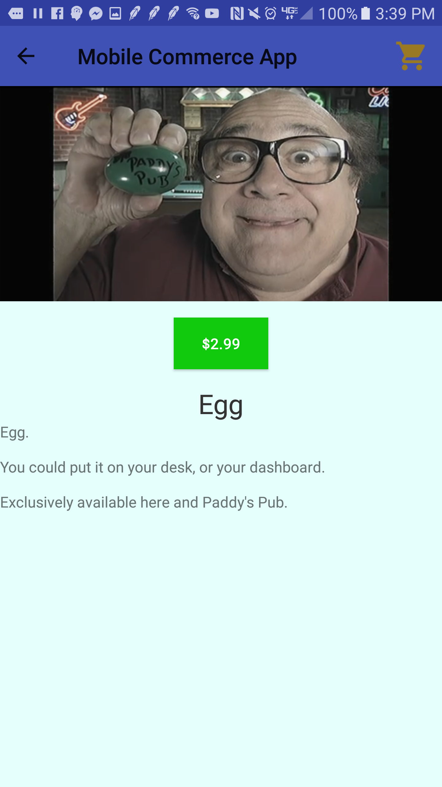

Welcome to my wonderful store front.
This app is a culmination of items that I have found stuck in between my sofa cushions.
The app greets you with a page that has legal information at the bottom which you can just ignore. Click on the button to continue to the store front.
In the store front page, the recyclerview takes up more columns depending on the size of your screen, 1 column for every 720 pixels.
Once at the store page, you can search for objects in the inventory based on either the name or the description. After searching if you wish to reset the items simply click the reset button conveniently located at the toolbar (looks like a refresh button when not in menu.)
Clicking on an item gives you access to the items details. This includes a (usually) short description, the name of the object, an image and the price. 
If you wish to add the object to your shopping cart simply press the button that displays the price. If a toast pops up telling you item was added, then you're in business.
From the details view, you can swipe either left or right to see the details of other items without the need to go back to the storefront activity.
If at any point you wish to check your shopping cart simply click the shopping cart icon located at either the detail activity or the storefront activity.
Once in the shopping cart activity you can see what items are in your shopping cart, the subtotal, taxes, S&H charges and total price are displayed as well. 
If you wish to remove any objects simply either swipe them away or long press them. Unfortunately at the moment the cost text does not refresh upon removing items. Click on continue shopping and go back to your shopping cart.
If you wish to checkout your wares, simply click on the button that displays the total price.

Thank you for shopping!

Known bugs:

-Price doesn't update on item removal.

-At times, extra decimals are displayed in the cost.

    

